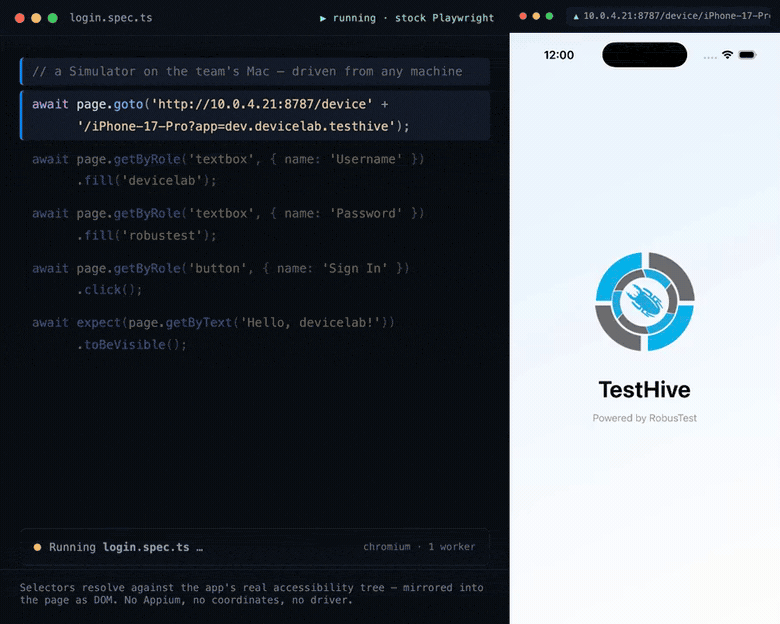
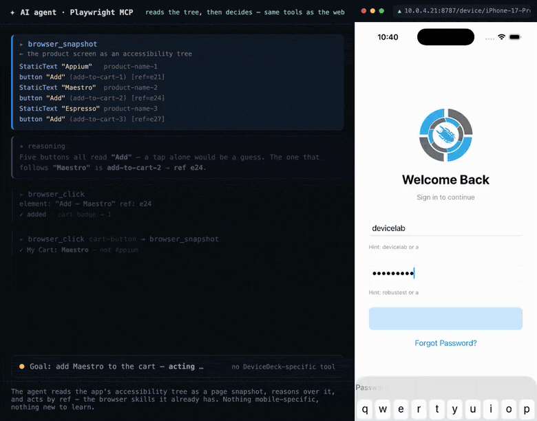

<div align="center">

# DeviceDeck

### Automate your iOS and Android app like a web app.

**With the tools you already know — Playwright, Cypress, Puppeteer — and the same AI agents you
already use to drive the web. No Appium, no new framework, no new agent to learn.**

<sub>iOS&nbsp;+&nbsp;Android&nbsp;·&nbsp;native UI mirrored as **real DOM**&nbsp;·&nbsp;your web tools &amp; agents, zero adapter&nbsp;·&nbsp;drive it by hand too, from any machine</sub>



<sub>A stock Playwright test — `page.goto()`, `getByRole().fill()`, `.click()` — running from another machine against an iOS Simulator on a Mac, through the DOM. No Appium, no coordinates.</sub>


[Two commands](#two-commands-two-superpowers) · [Quick start](#quick-start) · [Using it](#using-it) · [Docs](docs/) · [Known limits](#known-limits)

</div>

---

## Two commands, two superpowers

**1. Share your simulators — for manual testing.**

```bash
devicedeck serve --addr 0.0.0.0:8787
```

Anyone on your team then drives any simulator or emulator **from their own browser, on any
machine** — tap, type, **Inspect** the native tree — with no Xcode, no Android Studio, and no
local device. Your Macs' sims, shared like a web app.

**2. Automate it — with the tools you already use.**

```bash
claude mcp add playwright npx @playwright/mcp@latest    # the browser tool your agent already has
claude plugin marketplace add devicelab-dev/DeviceDeck  # DeviceDeck's skills (+ optional MCP)
```

Your AI agent now drives your mobile app through **Playwright MCP** — the same browser tool it uses
for the web — and your Playwright/Cypress **tests** drive it by selector too. It's real DOM, so: no
Appium, no new tool, no new skill.

One binary behind both — nothing to fork, no Xcode project to open.

## A device is a webpage

A single Go binary streams an iOS Simulator or Android emulator to a browser and mirrors the app's
native UI tree as **real DOM** — `data-testid` from accessibility identifiers, ARIA roles from
element types. So a person clicks it in a browser tab, and the automation tools you already own
drive it with no mobile-specific code, no Appium, and no coordinates:

```ts
await page.goto(`/device/${udid}?app=dev.devicelab.testhive`);
await page.getByRole('textbox', { name: 'Username' }).fill('devicelab');
await page.getByRole('textbox', { name: 'Password' }).fill('robustest');
await page.getByRole('button', { name: 'Sign In' }).click();
await expect(page.getByText('Hello, devicelab!')).toBeVisible();
```

That is a real iOS Simulator driven by stock Playwright. The same page and the same selectors drive
an Android emulator — or an AI agent through the browser tools it already has.

## Status

Working, not yet released. Both platforms drive end to end: **Playwright, Cypress and Puppeteer each
log into and check out of TestHive through the same DOM**, and the console drives any device by hand.
It is an ordinary web page, so any browser driver works with no mobile-specific code. Typing is
checked against the device's own read-back, so a keystroke that does not land is retyped rather than
lost — on iOS *and* on Android's masked password fields.

What that does not cover: it has only ever run on the machine it was built on. Expect first-contact
problems. See [**Known limits**](#known-limits).

## Requirements

- **macOS to *host*** — iOS Simulators, `simctl`/CoreSimulator, and the Swift sidecars are
  macOS-only, so the machine that runs the devices is a Mac. **Clients are any OS:** the surface is a
  web page, so people, tests, and agents drive it from Linux, Windows, or another Mac over the network.
- **Xcode** with at least one iOS Simulator runtime — **iOS 26.2 or newer is strongly recommended**;
  on 18.6 the simulator's render server crashes under repeated capture.
- **For Android:** the Android SDK with `adb` and `emulator` on `PATH`.

## Quick start

Install DeviceDeck whichever way you prefer, then run `devicedeck serve`.

**One-line script** — fetches the latest release and puts it on your `PATH`:

```bash
curl -fsSL https://raw.githubusercontent.com/devicelab-dev/DeviceDeck/main/install.sh | bash
```

**Release archive** — download it from [Releases](https://github.com/devicelab-dev/DeviceDeck/releases), extract, and run in place (the two sidecars sit beside the binary):

```bash
tar xzf devicedeck-<version>-darwin-arm64.tar.gz
cd devicedeck-<version>-darwin-arm64
```

**From source** — needs the Xcode toolchain for the Swift sidecars:

```bash
make sidecar
make build
```

Then start the server and open the console:

```bash
devicedeck serve        # → http://127.0.0.1:8787
```

Pick a device in the console and it boots and starts streaming.

## Using it

### With your tests

Point Playwright, Cypress, or Puppeteer at `/device/{udid}?app={bundleId}` — accessibility ids are
`data-testid`, roles and labels are ARIA, so you drive it with ordinary selectors (a single worker;
one driver per device). [`examples/`](examples/) has runnable login + checkout projects for all
three. **Guide:** [docs/testing.md](docs/testing.md).

### With an agent

An AI agent drives the device the same way it drives the web: it **snapshots the page**, reasons over
the tree, and acts by ref — no bespoke tool, no coordinates, no vision model. Here one uses stock
[Playwright MCP](https://github.com/microsoft/playwright-mcp) to pick the right **Add** among five
identical ones and add *Maestro* to the cart:

<div align="center">

</div>

That disambiguation is an [included spec](examples/playwright/tests/platform/mcp-agent.spec.ts) that
passes end to end. Setup is the two commands from [Two commands](#two-commands-two-superpowers), and
the plugin's skills teach the agent the device layer. **Guide:** [docs/agents.md](docs/agents.md).

### By hand — the console

The console lists every simulator and emulator, running or not. Click one to boot and stream it;
drive it with your mouse and keyboard, and **Inspect** overlays the native tree. Share it across a
team with `--addr` → [docs/device-farm.md](docs/device-farm.md).

The mirror has a few quirks a web test wouldn't expect — only the current screen is mirrored, fields
are real `<input>`s, typing is verified. See [docs/behaviors.md](docs/behaviors.md).

## Scope

Simulators and emulators only — no real hardware, no camera, biometrics, or carrier. Within that,
the ceiling is physics, not an artificial limit.

## Known limits

- **Android video is ~18 fps and much heavier than iOS.** The emulator's gRPC screenshot stream
  offers no video codec, so every frame is a full PNG rather than an H.264 delta. Emulators
  DeviceDeck boots run headless, because macOS throttles an occluded window and the emulator's window
  is occluded exactly when you are watching the browser.
- **A freshly launched app swallows touches for about a second** after its screen is already in the
  accessibility tree, reporting itself hittable and stable throughout — so there is nothing to wait on
  but the effect. `POST /app/launch` waits this window out for you: it returns when the app is actually
  taking input, so a test that launches through it can act at once. A raw terminate+launch outside the
  endpoint cannot, and must prove the app is taking input first.
- **Two-finger gestures are dropped on Android.** They work on iOS; there is no mapping for them in
  the Android driver, and they are discarded rather than guessed at.
- **A device serves one driver at a time**, and a second claim is refused rather than shared. That
  includes the console: a browser tab left open on a device will refuse your test run, and the refused
  page says so on screen. A driver that dies without closing its socket is detected by ping within
  about half a minute, and the device is released.
- **A raw relaunch does not reset app state** — a native app stays logged in across terminate+launch,
  the surprise that makes web-style tests flaky against it. `POST /app/launch` wipes the app's data
  first *by default*, starting at a first-run screen; pass `?reset=no` to resume where it was left.
- **The server is unauthenticated.** It binds to `127.0.0.1` by default; exposing it with `--addr` to
  share devices across a team is fine on a trusted network, but there is no access control yet — do
  not hang it on the open internet as-is.

## Licence

Apache License 2.0 — see [`LICENSE`](LICENSE).

## Built on

[maestro-runner](https://github.com/devicelab-dev/maestro-runner) for the device drivers, Apache-2.0.
The Swift sidecars derive from [baguette](https://github.com/tddworks/baguette) (Apache-2.0) and
[tapflow](https://github.com/jo-duchan/tapflow) (MIT); [`ATTRIBUTION.md`](ATTRIBUTION.md) records what
was reused and where it lives.

<p align="center">
  <a href="https://devicelab.dev"></a>
  <br>
  Built by <a href="https://devicelab.dev"><strong>devicelab.dev</strong></a>
</p>
